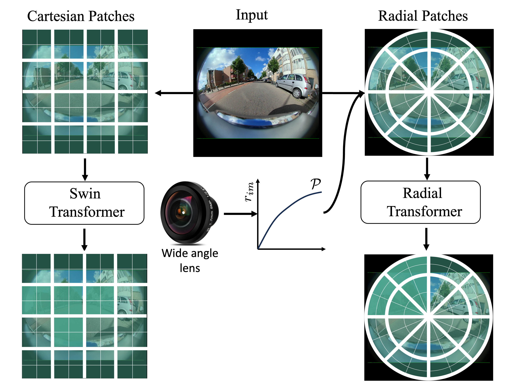
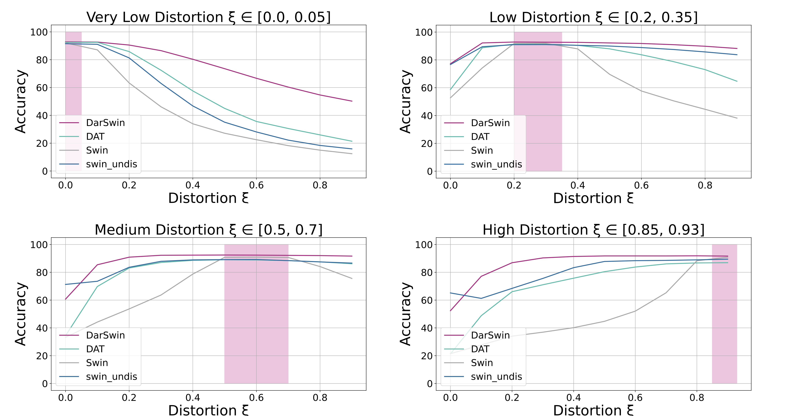

# Distortion Aware Radial Swin Transformer


This repo is the official implementation of ["DarSwin : Distortion Aware Radial Swin Transformer"](https://arxiv.org/pdf/2103.14030.pdf). It currently includes code and models for the following tasks:

> **Image Classification**: Included in this repo. See [get_started.md](get_started.md) for a quick start.


## Introduction

**Distortion Aware Radial Swin Transformer** (DarSwin) is initially described in [arxiv](https://arxiv.org/abs/2304.09691), which is a backbone based on Swin Transformer of distortion aware network for wide-angle image classification. The distortion-aware radial patches enable a better generalization to unseen lenses. 




## Main Results on ImageNet2010

Top-1 classification accuracy (mean) as a function of test distortion for our method (DarSwin-A) and previous state of the art: Deformable Attention Transformer (DAT), Swin Transformer, and Swin Transformer + undistortion (see text). All methods are trained on a restricted set of lens distortion curves (indicated by the pink shaded regions): (a) Very low, (b) low, (c) medium and (d) high distortion. We observe zero-shot adaptation to lens distortion of each approach by testing across all $\xi \in [0, 1]$.



## Citing DarSwin Transformer

```
@article{athwale2023darswin,
    title={DarSwin : Distortion Aware Radial Swin Transformer},
    author={Athwale, Akshaya and Afrasiyabi, Arman and Lagüe, Justin and Shili, Ichrak and Ahmad, Ola and Lalonde, Jean-Fran{\c{c}}ois},
    journal={IEEE/CVF International Conference on Computer Vision (ICCV)},
    year={2023}
  }  

```

## Getting Started

- For **Image Classification**, please see [get_started.md](get_started.md) for detailed instructions.


